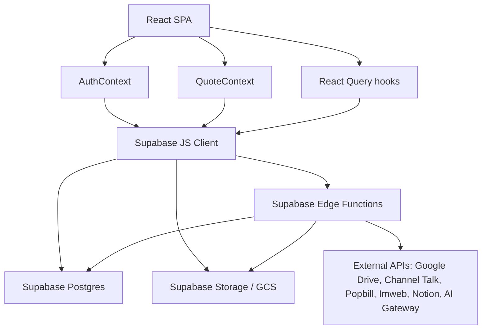

# DESIGN.md

작성일: 2026-05-19

이 문서는 현재 코드베이스를 기준으로 작성한 설계 초안이다. 제품 정책이나 운영 규칙의 최종 문서가 아니라, 이후 개발자가 빠르게 구조를 이해하고 변경 범위를 판단하기 위한 기술 설계 문서로 사용한다.

## 1. 시스템 개요

이 프로젝트는 아크뱅크 내부 업무를 처리하는 Vite + React + Supabase 기반 업무 시스템이다. 핵심 기능은 아크릴 판재/제품/공간 프로젝트 견적 계산, 견적 초안/발행 견적서 관리, 거래처/프로젝트/발주 관리, 직원 근태/연차/평가, 세금계산서/연말정산, 사내 커뮤니케이션, 상담 응대 보조다.

현재 애플리케이션은 단일 React SPA이며, 데이터 저장과 인증은 Supabase를 사용한다. 외부 연동과 권한이 높은 작업은 Supabase Edge Functions에서 처리한다.

## 2. 기술 스택

- Frontend: React 18, TypeScript, Vite
- Routing: `react-router-dom`
- Server state: `@tanstack/react-query`
- UI: shadcn-ui, Radix UI, Tailwind CSS, lucide-react
- Form/validation: react-hook-form, zod
- Rich text/editor: Tiptap
- Charts: recharts
- Backend/BaaS: Supabase Auth, Postgres, Storage, Edge Functions
- File/storage integrations: Supabase Storage, Google Cloud Storage, Google Drive
- AI/automation integrations: Lovable AI Gateway, Channel Talk webhook, OCR/document extraction
- Test/build scripts: ESLint, Vite build, pricing engine regression script

## 3. High-Level Architecture

설계상 브라우저는 대부분의 CRUD를 Supabase JS Client로 직접 수행한다. 서비스 롤 키가 필요한 작업, 외부 API 호출, 파일 마이그레이션, AI 생성, 사용자 관리 같은 작업은 Edge Function으로 분리되어 있다.

## 4. Frontend 구조

주요 디렉터리:

- `src/pages`: 라우트 단위 화면
- `src/components`: 도메인 컴포넌트와 공통 UI
- `src/components/ui`: shadcn-ui 기반 공통 컴포넌트
- `src/components/layout`: `PageShell`, `PageHeader`, `SearchFilterBar` 등 페이지 레이아웃
- `src/contexts`: 앱 전역 상태
- `src/hooks`: Supabase 쿼리/뮤테이션과 도메인 훅
- `src/services`: 재사용 가능한 데이터 저장/파일 처리 서비스
- `src/utils`: 가격 계산, 견적 표기, 파일 경로, 수율 계산 등 순수 로직
- `src/types`: 계산기/가격 타입과 상수
- `src/integrations/supabase`: Supabase client와 생성 타입

앱 진입점은 `src/main.tsx`다. Channel Talk 위젯 부팅 후 `App`을 렌더링한다.

`src/App.tsx`는 다음 Provider를 구성한다.

- `ThemeProvider`
- `QueryClientProvider`
- `TooltipProvider`
- `BrowserRouter`
- `AuthProvider`
- `QuoteProvider`

대부분의 페이지는 lazy loading으로 분리되어 초기 로딩 비용을 낮춘다.

## 5. Routing 설계

대표 라우트:

- `/`: 로그인 전에는 `LoginScreen`, 로그인 후에는 내부 대시보드
- `/calculator?type=quote`: 견적 계산기
- `/calculator?type=yield`: 수율 계산기
- `/quote-drafts`: 견적 초안함
- `/saved-quotes`, `/saved-quotes/:id`: 발행 견적서 목록/상세
- `/recipients`: 거래처 관리
- `/project-management`: 프로젝트 관리
- `/material-orders`: 원판 발주 관리
- `/team-chat`: 팀 채팅
- `/attendance`: 근태 관리
- `/leave-management`: 연차 관리
- `/performance-review`: 업무 평가
- `/tax-invoices`: 세금계산서
- `/year-end-tax`, `/year-end-tax-admin`: 연말정산
- `/response-assistant`: 상담 응대 보조
- `/response-assistant-management`: 상담 응대 지침/근거 관리
- `/channel-talk-leads`: 채널톡 문의 분석함
- `/admin-settings`: 관리자 설정 허브
- `/panel-management`: 원판/색상/사이즈 단가 관리
- `/processing-price-management`: 가공 가격 관리
- `/business-dashboard`: 경영 대시보드
- `/space-quote`, `/space-quotes`, `/space-quotes/:id`: 공간 프로젝트 견적

일부 구 라우트는 `Navigate`로 새 경로에 연결한다. 예를 들어 `/projects`는 `/project-management`로 이동한다.

## 6. 인증과 권한

인증은 Supabase Auth를 사용한다. `AuthContext`는 현재 사용자, 세션, 프로필, 역할 플래그를 관리한다.

역할 체계:

- `admin`
- `moderator`
- `manager`
- `employee`

역할 우선순위는 `admin > moderator > manager > employee`다. 기존 `user` 역할은 하위 호환을 위해 `employee`로 취급한다.

페이지 접근 제어는 `PageAccessGuard`와 `usePageAccess`가 담당한다. `page_role_access` 테이블에서 현재 경로의 `min_role`을 조회하고, 사용자 역할이 충분한지 판단한다. 일부 견적 관련 페이지는 작성자/담당자 소유 데이터가 있으면 접근을 허용하는 owner bypass 로직이 있다.

주의점:

- RLS 정책과 프론트엔드 guard가 함께 동작해야 한다. 프론트엔드 guard는 UX 장치일 뿐 보안 경계가 아니다.
- `supabase/config.toml`에서 여러 Edge Function의 `verify_jwt`가 `false`로 설정되어 있다. 각 함수 내부에서 토큰 검증, 서비스 키 사용 범위, 외부 webhook token 검증 여부를 별도로 점검해야 한다.

## 7. 전역 상태와 데이터 흐름

### AuthContext

`AuthContext`는 다음을 제공한다.

- Supabase 세션과 사용자
- `profiles` 조회 결과
- `user_roles` 기반 역할 플래그
- 회원가입, 로그인, 로그아웃, 프로필 수정
- 미승인 사용자 로그인 차단

### QuoteContext

`QuoteContext`는 견적 작성 중 상태를 담당한다.

- 견적 항목 배열
- 수신자/프로젝트/납기/결제 조건 정보
- 첨부 파일
- 현재 활성 견적 초안 ID
- 초안 제목, 저장 상태, 마지막 저장 시간, 오류 상태

비로그인 상태에서는 `localStorage`에 임시 견적을 저장한다. 로그인 이후에는 로컬 초안을 `quote_drafts`로 이전하고, 활성 초안 ID는 사용자별 localStorage key에 저장한다.

초안 저장은 자동 저장 중심이다. 견적 항목, 수신자, 견적번호, 제목이 바뀌면 1초 debounce 후 Supabase에 저장한다.

## 8. 견적/가격 계산 도메인

견적 계산의 중심은 다음 파일이다.

- `src/components/PanelCalculator.tsx`
- `src/hooks/usePriceCalculation.ts`
- `src/utils/priceCalculations.ts`
- `src/contexts/QuoteContext.tsx`
- `src/services/quoteDrafts.ts`
- `src/services/issuedQuoteSaver.ts`

지원하는 견적 스타일:

- `panel`: 판재 기준 견적
- `fabrication`: 제품 제작 기준 견적
- `space`: 공간 프로젝트 기준 견적
- `mixed`: 판재/제품 제작 혼합 견적

가격 계산은 정적 단가 데이터와 Supabase 단가 테이블을 함께 사용한다.

주요 데이터:

- `panel_masters`
- `panel_sizes`
- `panel_option_surcharges`
- `color_mixing_costs`
- `processing_options`
- `advanced_processing_settings`
- `panel_pricing_versions`

계산 결과는 단순 금액만 저장하지 않고, `calculationSnapshot`과 `calculation_snapshot`에 계산 당시의 단가 버전, breakdown, 총액, 품목별 근거를 함께 저장한다. 저장된 견적은 이후 단가표가 바뀌어도 기존 금액이 자동 재계산되지 않는 구조다.

발행 견적 저장은 `saveIssuedQuote`가 담당한다. `saved_quotes`에 견적 본문과 합계, 발신자/수신자 정보, 첨부파일, 계산 스냅샷을 저장한다. 초안 발행 시 `quote_drafts.status`를 `issued`로 변경하고 발행 견적 ID를 연결한다.

## 9. CRM, 프로젝트, 발주

거래처/프로젝트/발주 흐름은 다음 테이블을 중심으로 구성된다.

- `recipients`
- `recipient_notes`
- `projects`
- `project_assignments`
- `project_milestones`
- `project_updates`
- `saved_quotes`
- `material_orders`
- `internal_project_documents`

`ProjectManagementPage`는 클라이언트 프로젝트와 내부 프로젝트를 탭으로 분리한다. 프로젝트 상세에서는 견적, 거래처, 담당자, 마일스톤, 결제 상태, 내부 문서, 발주 내역, 수익성을 연결해 보여준다.

발행 견적서는 프로젝트에 연결될 수 있으며, 프로젝트 목록은 연결된 견적 수와 총액을 요약한다.

## 10. 파일과 문서 저장 설계

파일 저장은 현재 여러 provider를 지원한다.

- `supabase_storage`
- `gcs`
- `google_drive`
- `external_url`

공통 파일 메타데이터는 `document_files` ledger에 기록한다. 이 테이블은 견적, 프로젝트, 거래처 등 소유자를 연결하고, storage path, drive file id, drive path, sync status를 보관한다.

관련 구현:

- `src/services/documentFiles.ts`
- `src/utils/documentOrganization.ts`
- `src/hooks/useGcsStorage.ts`
- `supabase/functions/google-drive`
- `supabase/functions/gcs-storage`
- `supabase/functions/migrate-storage-to-gcs`
- `scripts/document-migration-dry-run.mjs`

Google Drive 경로는 `ACBANK_SYS` 루트를 기준으로 다음처럼 구성한다.

- 발행 견적서: `ACBANK_SYS/01_발행견적서/{year}/{month}/{quoteNumber}_{company}_{project}/{section}`
- 프로젝트: `ACBANK_SYS/02_프로젝트/{projectName}/{section}`
- 미분류: `ACBANK_SYS/99_미분류/{section}`

## 11. 커뮤니케이션과 AI 응대 보조

사내 커뮤니케이션:

- `team_messages`
- `direct_messages`
- `notifications`
- `announcements`
- `peer_feedback`

상담 응대 보조:

- 페이지: `ResponseAssistantPage`
- 전역 플로팅 위젯: `FloatingResponseAssistant`
- 설정/근거 관리: `ResponseAssistantManagementPage`
- Edge Function: `generate-response-draft`
- 데이터: `response_knowledge_items`, `response_cases`, `response_drafts`, `response_assistant_settings`

`generate-response-draft`는 사용자 인증 토큰을 확인한 뒤, 선택된 상담 근거와 관련 견적/프로젝트 데이터를 모아 Lovable AI Gateway에 요청한다. 결과는 톤별 초안, 요약, 설득 포인트, 공감 포인트, 피해야 할 표현, 위험도, 검수 필요 여부로 저장한다.

채널톡 문의 분석:

- Edge Function: `channel-talk-webhook`
- 데이터: `channel_talk_quote_leads`

채널톡 webhook은 고객 메시지의 첨부파일을 추출하고, 이미지/PDF를 AI Gateway로 분석한다. 분석 결과는 리드로 저장하고, 채널톡 내부 비공개 메시지와 관리자 알림을 생성한다.

## 12. 인사/근태/평가 도메인

직원 관련 기능은 다음 테이블을 중심으로 구성된다.

- `profiles`
- `user_roles`
- `attendance_records`
- `leave_requests`
- `leave_policy_settings`
- `leave_general_settings`
- `leave_adjustments`
- `custom_leave_types`
- `performance_review_cycles`
- `review_cycle_targets`
- `performance_reviews`
- `performance_review_scores`
- `performance_review_categories`
- `performance_review_summaries`
- `incident_reports`
- `document_categories`
- `employee_documents`
- `contract_templates`
- `employment_contracts`

근태/연차/평가/직원 문서/근로계약은 프론트엔드 페이지와 컴포넌트가 Supabase 테이블을 직접 조회하고 변경한다. 급여 계산, 초과근무 감지, 연차 승급 처리처럼 서버 권한이 필요한 작업은 Edge Function으로 분리되어 있다.

## 13. 세무, 경영, 외부 연동

세무/정산:

- `tax_invoices`
- `year_end_tax_settlements`
- `tax_dependents`
- `tax_deduction_items`
- `tax_documents`

외부 연동:

- Popbill: 사업자/세금계산서 관련 API 중계
- Imweb: 상품/주문/동기화 로그 관리
- Notion: 프로젝트 연동
- Google Drive: 파일 정리와 문서 동기화
- Channel Talk: 고객 견적 문의 첨부파일 분석
- Lovable AI Gateway: 응대 초안, 첨부파일 분석

관련 Edge Functions:

- `popbill-api`
- `imweb-api`
- `notion-projects`
- `google-drive`
- `gcs-storage`
- `ocr-document`
- `extract-business-info`
- `simulate-tax`

## 14. Supabase Edge Functions

현재 확인된 함수:

- `admin-update-user`: 관리자 사용자 정보 변경
- `delete-user`: 사용자 삭제
- `password-reset`: 비밀번호 초기화 요청 처리
- `calculate-salary`: 계약/근로 조건 기반 급여 계산
- `leave-promotion-check`: 연차 승급 처리
- `overtime-detection`: 초과근무 감지
- `popbill-api`: Popbill API 중계
- `gcs-storage`: GCS 업로드/다운로드/삭제/서명 URL
- `google-drive`: Google Drive 파일 작업
- `migrate-storage-to-gcs`: 기존 storage 파일 GCS 이전
- `ocr-document`: 문서 OCR
- `extract-business-info`: 사업자등록증 정보 추출
- `imweb-api`: Imweb 동기화
- `notion-projects`: Notion 프로젝트 연동
- `channel-talk-webhook`: 채널톡 첨부 견적 문의 분석
- `generate-response-draft`: 상담 응대 초안 생성
- `auto-expire-quotes`: 견적 만료 자동 처리
- `simulate-tax`: 연말정산 세액 시뮬레이션

## 15. 데이터베이스 주요 테이블 그룹

견적/가격:

- `saved_quotes`
- `quote_drafts`
- `quote_versions`
- `quote_stage_history`
- `quote_memos`
- `quote_templates`
- `quote_template_sections`
- `quote_template_items`
- `panel_masters`
- `panel_sizes`
- `panel_prices`
- `panel_option_surcharges`
- `panel_pricing_versions`
- `color_options`
- `color_mixing_costs`
- `processing_options`
- `processing_categories`
- `advanced_processing_settings`
- `adhesive_costs`
- `slot_types`
- `category_logic_slots`
- `yield_calculation_history`
- `yield_cut_presets`

영업/프로젝트:

- `recipients`
- `recipient_notes`
- `projects`
- `project_assignments`
- `project_milestones`
- `project_updates`
- `material_orders`
- `internal_project_documents`
- `space_project_quotes`
- `tax_invoices`

인사/커뮤니케이션:

- `profiles`
- `user_roles`
- `page_role_access`
- `attendance_records`
- `leave_requests`
- `leave_policy_settings`
- `leave_general_settings`
- `leave_adjustments`
- `custom_leave_types`
- `team_messages`
- `direct_messages`
- `notifications`
- `announcements`
- `peer_feedback`
- `performance_review_cycles`
- `review_cycle_targets`
- `performance_reviews`
- `performance_review_scores`
- `performance_review_categories`
- `performance_review_summaries`
- `incident_reports`
- `document_categories`
- `employee_documents`
- `contract_templates`
- `employment_contracts`

문서/외부 연동:

- `document_files`
- `channel_talk_quote_leads`
- `response_knowledge_items`
- `response_cases`
- `response_drafts`
- `response_assistant_settings`
- `imweb_oauth_tokens`
- `imweb_products`
- `imweb_orders`
- `imweb_sync_logs`
- `portfolio_posts`
- `portfolio_images`
- `exhibitions`
- `exhibition_checklist_items`
- `exhibition_consultations`
- `exhibition_links`
- `sample_chip_inventory`
- `sample_chip_transactions`
- `year_end_tax_settlements`
- `tax_dependents`
- `tax_deduction_items`
- `tax_documents`
- `activity_logs`
- `password_reset_requests`
- `company_info`
- `company_holidays`
- `labor_law_settings`
- `secret_events`

## 16. UI/디자인 시스템

Tailwind CSS와 shadcn-ui를 기반으로 한다. `src/index.css`에 CSS variable 기반 색상 토큰, light/dark theme, surface style, typography utility가 정의되어 있다. 현재 방향은 리디자인이 아니라 기존 화면 구조를 유지한 상태에서 폰트, 자간, 보더, radius, shadow, 대비를 정돈하는 것이다.

공통 페이지 구성은 `PageShell`, `PageHeader`, `SearchFilterBar`를 사용한다. `GlobalQuickNav`는 로그인된 사용자에게 Ctrl/Cmd+K 기반 빠른 이동을 제공한다. 관리자/중간관리자 전용 메뉴는 역할에 따라 필터링된다.

폰트는 `public/fonts`의 Apple SD Gothic Neo와 Horizon을 로드한다.

디자인 적용 원칙:

- 홈 화면 위젯 순서, 페이지별 기능, 라우팅, 주요 grid 비율은 변경하지 않는다.
- 라이트모드와 다크모드는 모두 유지하며, 두 모드 모두 같은 정보 밀도와 컴포넌트 비율을 갖도록 한다.
- 1차 수정은 `src/index.css`의 전역 토큰과 `glass-card`, `glass-surface`, `glass-pill`, typography utility를 우선한다.
- 2차 수정은 `Card`, `PageShell`, `PageHeader`, `SearchFilterBar` 같은 공통 컴포넌트의 padding, radius, border, title size, description size만 다룬다.
- 개별 페이지 수정은 공통 적용 후에도 이질감이 남는 화면에 한정하고, 레이아웃 재배치가 아니라 밀도와 대비 보정만 허용한다.

세부 스타일 기준:

- 본문과 숫자 정보는 Apple SD Gothic Neo 기반으로 유지하고, 숫자는 tabular nums를 사용해 견적/정산/관리 화면의 열 정렬 안정성을 높인다.
- display/headline 계열의 자간은 과하게 조이지 않고 `tracking-normal`을 기본으로 한다.
- 카드 radius는 기존보다 낮춰 운영 도구에 맞는 밀도를 만든다. 반복 카드와 필터바는 12px 안팎을 기준으로 한다.
- glass 표현은 강한 blur/gradient보다 단색 surface, hairline border, 낮은 shadow 중심으로 사용한다.
- primary color는 CTA와 active state를 위한 절제된 blue accent로 유지한다. 화면 전체가 특정 hue에 지배되지 않도록 한다.
- 다크모드는 보라/남색 그라데이션 대신 charcoal surface와 blue accent를 사용해 라이트모드와 같은 위계를 유지한다.

페이지 유형별 보정 기준:

- Dashboard형: 홈, 비즈니스 대시보드, 관리자 허브는 카드 shadow를 약하게 두고 카드 간 정보 밀도를 유지한다.
- Data table형: 견적서, 고객사, 프로젝트, 리드 관리 페이지는 행 높이, 필터바 대비, border 가독성을 우선한다.
- Calculator형: 견적 계산기와 가격 관리 화면은 선택 카드의 active border, 단계 표시, 숫자 정보 대비를 우선한다.
- Document/print형: 견적서 출력과 고객용 문서는 인쇄 안정성을 우선하며 shadow와 배경 효과 변경을 최소화한다.

## 17. 테스트와 검증

현재 스크립트:

- `npm run dev`: Vite 개발 서버
- `npm run build`: 프로덕션 빌드
- `npm run build:dev`: development mode 빌드
- `npm run lint`: ESLint
- `npm run test:pricing`: 가격 계산 회귀 테스트
- `npm run docs:dry-run`: 문서/Drive 마이그레이션 dry run 리포트 생성

가격 계산 회귀 테스트는 `tests/pricing-engine-regression.ts`를 esbuild로 번들링해 실행한다. 원판 단독 구매, 레이저 가공, 무기포 접착, 미등록 단가 차단, 엣지 경면 등 핵심 가격 로직을 검증한다.

## 18. 현재 설계상 주의점

1. 데이터 모델은 도메인별로 넓게 확장되어 있고, 일부 값은 JSON column에 스냅샷으로 저장된다. 빠른 개발에는 유리하지만 리포팅/정합성 검증에는 별도 관리가 필요하다.
2. 가격 계산 로직은 프론트엔드 util에 크고 복잡하게 모여 있다. 핵심 비즈니스 로직이므로 변경 시 `npm run test:pricing`을 최소 검증 기준으로 삼아야 한다.
3. Edge Function 다수가 `verify_jwt = false`다. webhook이나 관리자성 함수는 내부 인증/토큰 검증이 있는지 함수별로 감사해야 한다.
4. `README.md`는 Lovable 기본 템플릿 수준이다. 실제 운영/개발 가이드는 이 문서와 별도 `README` 갱신이 필요하다.
5. `bun.lock`, `bun.lockb`, `package-lock.json`이 함께 존재한다. 공식 패키지 매니저를 정하고 lockfile 정책을 정리하는 편이 좋다.
6. `src/App.css`에는 Vite 기본 템플릿 흔적이 남아 있다. 실제 사용 여부를 확인해 제거할 수 있다.
7. Supabase 타입 파일은 자동 생성본이므로 직접 수정하지 않는다. 마이그레이션 적용 후 타입 재생성 절차가 필요하다.
8. 일부 화면은 인라인 className으로 `rounded-2xl`, `shadow`, `backdrop-blur`, `bg-gradient` 계열 표현을 직접 가진다. 디자인 디테일 조정은 공통 토큰/공통 컴포넌트 적용 후 캡처 비교에서 튀는 화면만 선별 보정한다.

## 19. 향후 정리 제안

- 환경 변수 문서화: Supabase, GCS, Google Drive, Channel Talk, Lovable AI, Popbill, Imweb, Notion
- RLS/Edge Function 보안 감사표 작성
- 견적 계산 엔진의 입력/출력 계약 문서화
- 핵심 도메인별 데이터 ERD 작성
- 가격 계산 테스트 케이스 확장
- `README.md`를 실제 로컬 개발/배포/운영 문서로 교체
- lockfile 정책 정리
- Supabase migration 명명/소유 도메인 기준 정리
- 파일 provider 전환 정책과 `document_files` 동기화 실패 복구 절차 문서화
- 홈, 견적 계산기, 프로젝트 관리, 저장 견적서, 관리자 설정 화면의 라이트/다크 캡처 기준선 작성
- 남아 있는 인라인 gradient/shadow/backdrop-blur 사용처를 화면 영향도 기준으로 단계적 정리
